<<<<<<< HEAD
# Linux（服务器操作系统)

# 第一章

## 1 操作系统概述

### 1.1 操作系统作用

调度和管理硬件

### 1.2 常见操作系统

PC端：Windows11，Linux, MacOS,

移动端：Andeoid，IOS，HarmonyOS


## 2 Linux初识

**Linux创始人：林纳斯.托瓦兹，1991**

**Linux内核**

<u>系统组成：</u>

- Linux系统内核（开源）
- 系统级应用程序

<u>功能:</u>

- 内核功能：调度cpu，调度内存，调度文件系统，调度通讯网络，调度IO等（调度硬件）
- 系统及应用程序：可理解为系统自带程序，可供用户快速上手操作系统，如：文件管理器，任务管理器，图片查看，音乐播放等。

**Linux发行版**

内核免费且开源，也代表了：

- 任何人都可以获得并修改内核，并自行集成系统级程序
- 提供了内核+系统级程序的完整封装，称之为Linux发行版


常用：CentOS,Ubantu


## 3 虚拟机介绍

### 3.1 什么是虚拟机？ 

虚拟的硬件+操作系统=虚拟的电脑

### 3.2 为什么用虚拟机？

获取Linux系统


## 4 Vmare Workstation 的安装


下载地址:https://www.vmware.com/cn/products/workstation-pro.html


## 5 远程连接Linux系统

### 5.1 操作系统的图形化、命令行2种操作模式

- 图形化操作是指使用操作系统附带的图形化页面，以图形化的窗口形式获得操作反馈，从而对操作系统进行操作、使用
- 命令行操作是指使用各种命令，以文字字符的形式获得操作反馈从而对操作系统进行操作、使用

### 5.2 理解为什么使用命令行操作Linux系统

- Linux从诞生至今，在图形化页面的优化上，并未重点发力。所以Linux操作系统的图形化页面:不好用、不稳定
- 在开发中，使用命令行形式，效率更高，更加直观，并且资源占用低，程序运行更稳定。

### 5.3 掌握使用FinalShell软件连接Linux操作系统

- 内容的复制、粘贴跨越VMware不方便
- 文件的上传、下载跨越VMware不方便
- 也就是和Linux系统的各类交互，跨越VMware不方便

我们可以通过第三方软件，FinalShell，远程连接到Linux操作系统之上。并通过Finalshell去操作Linux系统。

<u>Finalshell的下载地址为:</u>

[FinalShell SSH工具,服务器管理,远程桌面加速软件,支持Windows,macOS,Linux,版本4.5.6,更新日期2024.8.27 - FinalShell官网 (hostbuf.com)](https://www.hostbuf.com/t/988.html)


## 6 WSL

WSL作为Windows10系统带来的全新特性，正在逐步颠开发人员既有的选择。

- 传统方式获取Linux操作系统环境，是安装完整的虚拟机，如VMware
- 使用WSL，可以以非常轻量化的方式，得到Linux系统环境

目前，开发者正在逐步抛弃以虚拟机的形式获取Linux系统环境，而在逐步拥抱WSL环境。

WSL:Windows Subsystem for Linux，是用于Windows系统之上的Linux子系统
作用很简单，可以在Windows系统中获得Linux系统环境，并完全**直连计算机硬件**，无需通过虚拟机虚拟硬件


## 7 虚拟机快照的制作和还原

在学习阶段我们无法避免的可能损坏Linux操作系统。
如果损坏的话，重新安装一个Linux操作系统就会十分麻烦。


VMware虚拟机(Workstation和Funsion)支持为虚拟机制作快照。通过快照将当前虚拟机的状态保存下来,在以后可以通过快照恢复虚拟机到保存的状态

### 7.1 在VMware Workstation Pro中制作快照


### 7.2 **在VMware Workstation Pro中还原快照**


# 第二章

## 1 Linux目录结构

### 1.1 Linux的目录结构

Linux没有盘符这个概念,只有一个根目 / 所有文件都在它下面

### 1.2 Linux路径的描述方式

- 
  在Linux系统中，路径之间的层级关系，使用:/来表示

- 在windows系统中，路径之间的层级关系，使用:\来表示

  

## 2 Linux命令入门

### 2.1 什么是命令、命令行

- 命令:即Linux操作指令,是系统内置的程序，可以以字符化的形式去使用
- 命令行:即Linux终端,可以提供字符化的操作页面供命令执行

### 2.2 Linux命令的通用格式

~~~ shell
command [-option][parameter]
~~~

- 命令本体，即命令本身
- 可选选项，控制命令的行为细节
- 可选参数，控制命令的指向目标

## 3 ls命令入门

~~~shell
ls [-a -l -h][Linux路径]
~~~

### 3.1 ls命令作用

在命令行中，以平铺的形式,展示当前工作目录(默认HOME目录)下的内容(文件或文件夹)


### 3.2 HOME目录

每一个用户在Linux系统的专属目录，默认在:/home/用户名

### 3.3 当前工作目录

Linux命令行在执行命令的时候,需要一个工作目录,打开命令行程序(终端)默认设置工作目录在用户的HOME目录

## 4 ls命令的参数和选项

### 4.1 ls命令的参数的作用

可以指定要查看的文件夹(目录)的内容,如果不给定参数,就查看当前工作目录的内容

### 4.2 ls命令的选项:

- -a 选项，可以展示出隐藏的内容，以 . 开头的文件或文件夹默认被隐藏，需要-a才能显示出来


- -l 选项，以列表的形式展示内容,并展示更多细节


- -h 选项，需要和-l选项搭配使用，以更加人性化的方式显示文件的大小单位


### 4.3 命令的选项组合使用

命令的选项是可以组合使用的，比如:ls -lah,等同于ls -a- l -h


## 5 cd/pwd命令

### 5.1 cd命令的作用

cd命令来自英文:Change Directorycd命令可以切换当前工作目录，语法是:

~~~shell
cd[Linux路径]
~~~

- 没有选项，只有参数，表示目标路径
- 使用参数切换到指定路径
- 不使用参数，切换工作目录到当前用户的HOME

### 5.2 pwd命令的作用

- pwd命令来自英文:Print Work Directory

- pwd命令，没有选项，没有参数，直接使用即可
- 作用是:输出当前所在的工作目录


## 6 相对命令、绝对命令

### 6.1 相对路径和绝对路径

- 绝对路径:以根目录做起点，描述路径的方式，路径以/开头
- 相对路径:以当前目录做起点，描述路径的方式，路径不需以/开头如无特殊需求

### 6.2 特殊路径符

- . 表示当前目录，比如cd.或cd./Desktop
- .. 表示上一级目录，比如:cd.. 或 cd../.
- ~ 表示用户的HOME目录，比如:cd\~或cd\~/Desktop


## 7 mkdir命令

### 7.1 mkdir命令的语法和功能

- mkdir用以创建新的目录(文件夹)
- 语法:

~~~shell
mkdir[-p]Linux路径
~~~

- 参数**必填**，表示要创建的目录的路径，相对、绝对、特殊路径符都可以使用

### 7.2 -p选项的作用

**可选**，表示自动创建不存在的父目录，适用于创建**连续多层**级的目录

## 8 touch、cat、more命令

### 8.1 touch命令

- 用于创建一个新的文件
- 语法:

~~~shell
touch Linux路径
~~~

- 参数必填，表示要创建的文件的路径，相对、绝对、特殊路径符都可以使用

### 8.2 cat命令

- 用于查看文件内容
- 语法:

~~~shell
cat Linux路径
~~~

- 参数必填，表示要查看的文件的路径，相对、绝对、特殊路径符都可以使用

### 8.3 more命令

- 用于查看文件内容，可翻页查看
- 语法: 

~~~shell
more Linux路径
~~~

- 参数必填，表示要查看的文件的路径，相对、绝对、特殊路径符都可以使用使用空格进行翻页，使用q退出查看

## 9 cp、mv、rm命令

### 9.1 cp命令

- 用于复制文件或文件夹

- 语法:

  ~~~shell
  cp[-r]参数1 参数2
  ~~~

- -r选项，可选，用于复制文件夹使用，表示递归

- 参数1，Linux路径，表示被复制的文件或文件夹

- 参数2，Linux路径，表示要复制去的地方

### 9.2 mv命令

- 用于移动或重命名文件/文件夹

- 语法:

  ~~~shell
  mv 参数1 参数2
  ~~~

- 参数1，Linux路径，表示被移动的文件或文件夹

- 参数2，Linux路径，表示要移动去的地方，如果目标不存在，则进行改名

### 9.3 rm命令

- 用于删除文件或文件夹

- 语法:

  ~~~shell
  rm[-r-f]参数1 参数2参数N
  ~~~

- -r选项，可选，文件夹删除

- -f选项，可选，用于强制删除(不提示，一般用于root用户)参数，表示被删除的文件或文件夹路径，支持多个，空格隔开参数也支持**通配符 ***，用以做模糊匹配


## 10 which,find命令

### 10.1 which命令

- 查找命令的程序文件

- 语法:

  ~~~shell
  which 要查找的命令
  ~~~

- 无需选项，只需要参数表示查找哪个命令

### 10.2 find命令

- 用于查找指定的文件

- 按文件名查找:

  ~~~shell
  find 起始路径 -name“被查找文件名
  ~~~

  - 支持通配符

- 按文件大小查找:

  ~~~shell
  find 起始路径-size +| -n[kMG]
  ~~~


## 11 grep,wc,管道符

### 11.1 grep命令

- 从文件中通过关键字过滤文件行

- 语法:

  ~~~shell
  grep[-n]关键字 文件路径
  ~~~

- 选项-n，可选，表示在结果中显示匹配的行的行号，

- 参数，关键字，必填，表示过滤的关键字，建议使用””将关键字包围起来

- 参数，文件路径，必填，表示要过滤内容的文件路径，**可作为管道符的输入**

### 11.2 wc命令

- 命令统计文件的行数、单词数量、字节数、字符数等

- 语法:

  ~~~shell
  wc[-c-m-1-w]文件路径
  ~~~

- 不带选项默认统计:行数、单词数、字节数

- -c字节数、-m字符数、-l行数、-w单词数

- 参数，被统计的文件路径，可作为**管道符的输入**

### 11.3 管道符|

将管道符左边的结果，作为右边命令的输入


## 12 echo,tail,重定向符

### 12.1 echo

- 可以使用echo命令在命令行内输出指定内容
- 语法:

~~~shell
echo 输出的内容
~~~

- 无需选项，只有一个参数，表示要输出的内容，复杂内容可以用””包围

### 12.2 反引号符

- 被`包围的内容，会被作为命令执行，而非普通字符

### 12.3 重定向符

- 将符号左边的结果，输出到右边指定的文件中去


- `>`，表示覆盖输出
- `>>`，表示追加输出

### 12.4 tail

- 使用tail命令，可以查看文件尾部内容，跟踪文件的最新更改

- 语法:

  ~~~shell
  tail[-f -num]Linux路径
  ~~~

- 参数，Linux路径，表示被跟踪的文件路径

- 选项，-f，表示持续跟踪

- 选项,-num，表示，查看尾部多少行，不填默认10行


## 13 vi编辑器

vi\vim是visual interface的简称,是Linux中最经典的文本编辑器

同图形化界面中的文本编辑器一样，vi是命令行下对文本文件进行编辑的绝佳选择。

vim 是 vi 的加强版本，兼容 vi 的所有指令，不仅能编辑文本，而且还具有 shelll程序编辑的功能，可以不同颜色的字体来辨别语法的正确性，极大方便了程序的设计和编辑性。


<center class="half">
    
    
</center>

### 13.1 三种工作模式

- 命令模式，默认的模式，可以通过键盘快捷键控制文件内容
- 输入模式，通过命令模式进入，可以输入内容进行编辑，按esc退回命令模式
- 底线命令模式，通过命令模式进入，可以对文件进行保存、关闭等操作


### 13.2 命令模式快捷键


### 13.3 底线命令快捷键


# 第三章

## 1 Linux的root用户

### 1.1 root用户

root用户拥有最大的系统操作权限,而普通用户在许多地方的权限是受限的。

演示:

- 使用普通用户在根目录下创建文件夹

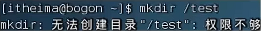

- 切换到root用户后,继续尝试

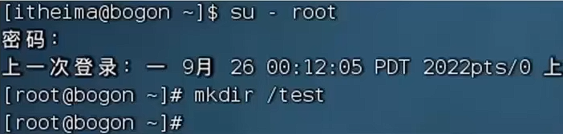

- 普通用户的权限，一般在其HOME目录内是不受限的
- 一旦出了HOME目录,大多数地方,普通用户仅有只读和执行权限,无修改权限

### 1.2 su命令

- 可以切换用户，语法:

  ~~~shell
  su[-][用户名]
  ~~~

- 表示切换后加载环境变量，建议带上

- 用户可以省略,省略默认切换到root

### 1.3 sudo命令

- 可以让一条普通命令带有root权限,语法:

  ~~~shell
  sudo 其它命令
  ~~~

- 需要以root用户执行visudo命令,增加配置方可让普通用户有sudo命令的执行权限

**为普通用户配置sudo认证**

- 切换到root用户，执行visudo命令,会自动通过vi编辑器打开:/etc/sudoers

- 在文件的最后添加:

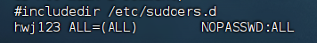

- 其中最后的NOPASSWD:ALL表示使用sudo命令，无需输入密码

- 最后通过 wq 保存


## 2 用户和用户组

# 第四章

## 软件安装

### 1 在CentOs系统中，使用yum命令联网管理软件安装

yum语法:

~~~shell
yum[-y][install|remove|search]软件名称
~~~

### 2 在Ubuntu系统中,使用apt命令联网管理软件安装

apt语法:

~~~shell
apt[-y][install|remove|search]软件名称
~~~

卡住不动？**更新镜像源**

- 备份原来的 `CentOS-Base.repo`：

~~~shell
cp /etc/yum.repos.d/CentOS-Base.repo /etc/yum.repos.d/CentOS-Base.repo.bak
~~~

- 编辑 `/etc/yum.repos.d/CentOS-Base.repo` 文件：

~~~shell
vim /etc/yum.repos.d/CentOS-Base.repo
~~~

- 将内容替换为以下阿里云的镜像源：

~~~
[base]
name=CentOS-$releasever - Base
baseurl=http://mirrors.aliyun.com/centos/$releasever/os/$basearch/
gpgcheck=1
gpgkey=file:///etc/pki/rpm-gpg/RPM-GPG-KEY-CentOS-7

[updates]
name=CentOS-$releasever - Updates
baseurl=http://mirrors.aliyun.com/centos/$releasever/updates/$basearch/
gpgcheck=1
gpgkey=file:///etc/pki/rpm-gpg/RPM-GPG-KEY-CentOS-7

[extras]
name=CentOS-$releasever - Extras
baseurl=http://mirrors.aliyun.com/centos/$releasever/extras/$basearch/
gpgcheck=1
gpgkey=file:///etc/pki/rpm-gpg/RPM-GPG-KEY-CentOS-7
~~~

- 在修改源之后，清理缓存并更新 YUM：

~~~shell
yum clean all
yum makecache
~~~

- 然后重新尝试安装 `wget`：

```shell
yum install wget
```


## systemctl命令控制软件的启动和关闭

1 systemctl命令的作用
可以控制软件(服务)的启动、关闭、开机自启动

- 系统内置服务均可被systemctl控制
- 第三方软件，如果自动注册了可以被systemctl控制
- 第三方软件，如果没有自动注册，可以手动注册

2 语法

~~~shell
systemctl start | stop | status | enable | disable 服务名
~~~

## 软连接

### 1 什么是软连接?

可以将文件、文件夹链接到其它位置
链接只是一个指向，并不是物理移动，类似Windows系统的快捷方式

### 2 软连接的使用语法

~~~shell
ln -s 参数1 参数2
~~~

- -s选项，创建软连接
- 参数1:被链接的文件或文件夹
- 参数2:要链接去的目的地

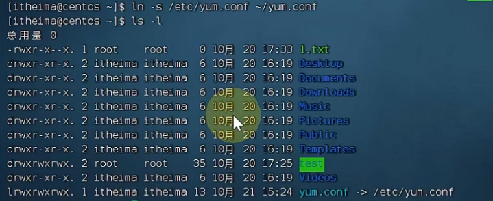


## 日期和时区

### 1 date命令的作用和用法

- date命令可以查看日期时间，并可以格式化显示形式以及做日期计算
- 语法:

~~~shell
date[-d][+格式化字符串]
~~~

- %Y 年
- %y 年份后两位数字(00.99).
- %m 月份
- %d 日
- %H 小时
- %M 分钟
- %S秒
- %s自1970-01-01 00:00:00 UTC 到现在的秒数

### 2 如何修改Linux时区

~~~shell
rm -f /etc/localtime
ln -s /usr/share/zoneinfo/Asia/Shanghai /etc/localtime
~~~

### 3 ntp的作用

可以自动联网同步时间,也可以通过`ntpdate -untp.aliyun.com`手动校准时间


## IP地址和主机名

### 1.什么是IP地址,有什么作用?

- IP地址是联网计算机的网络地址，用于在网络中进行定位
- 格式是:a.b.c.d,其中abcd是0~255的数字
- 特殊IP有:127.0.0.1,本地回环IP,表示本机。
- 0.0.0.0:也可表示本机,也可以在一些白名单中表示任意IP

### 2.什么是主机名?

- 主机名就是主机的名称，用于标识一个计算机

### 3.什么是域名解析(主机名映射)

- 可以通过主机名找到对应计算机的IP地址，这就是主机名映射(域名解析)
- 先通过系统本地记录查找（host），如果找不到就联网去公开DNS服务器去查找

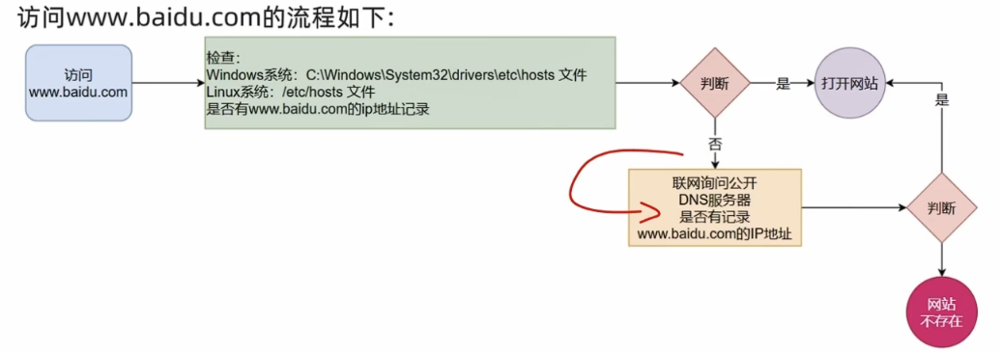

## 配置Linux固定IP地址

### 1 为什么需要固定IP？

当前我们虚拟机的Linux操作系统，其IP地址是通过DHCP服务获取的。

DHCP:动态获取IP地址,即每次重启设备后都会获取一次，可能导致IP地址频繁变更

原因1:办公电脑IP地址变化无所谓,但是我们要远程连接到Linux系统,如果IP地址经常变化我们就要频繁修改适配很麻烦

原因2:在刚刚我们配置了虚拟机P地址和主机名的映射,如果IP频繁更改,我们也需要频繁更新映射关系

综上所述，我们需要IP地址固定下来，不要变化了。

### 2 在VMware Workstation中配置固定IP

配置固定IP需要2个大步骤:

- 在VMware Workstation(或Fusion)中配置IP地址网关和网段(IP地址的范围）
- 在Linux系统中手动修改配置文件，固定IP


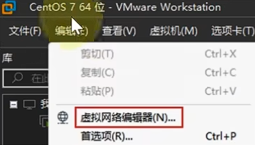


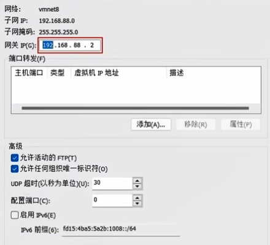

- 使用vim编辑/etc/sysconfig/network-scripts/ifcfg-ens33文件,填入如下内容

~~~
TYPE="Ethernet"
PROXY_METHOD="none"
BROWSER_ONLY="no"
BOOTPROTO="static"
DEFROUTE="yes"
IPV4_FAILURE_FATAL="no"
IPV6INIT="yes"
IPV6_AUTOCONF="yes"
IPV6_DEFROUTE="yes"
IPV6_FAILURE_FATAL="no"
IPV6_ADDR_GEN_MODE="stable-privacy"
NAME="ens33"
UUID="fe2bd086-14bc-4f40-83ab-c50ef3586f13"
DEVICE="ens33"
ONBOOT="yes"
IPADDR="192.168.88.130"
NETMASK="255.255.255.0"
GATEWAY="192.168.88.2"
DNS1="192.168.88.2"
~~~


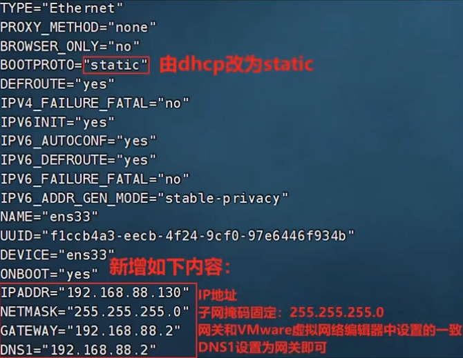

- 执行：

~~~shell
systemctl restart network
~~~


## 网络请求和下载

1 ping命令

- 通过ping命令,检查指定的网络服务器是否是可联通状态
- 语法:

~~~shell
ping[-c num]ip或主机名
~~~

- 选项:-c,检查的次数,不使用-c选项,将无限次数持续检查
- 参数:ip或主机名，被检查的服务器的ip地址或主机名地址

示例：

- 检查baidu.com是否联通

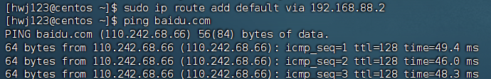

- 检查baidu.com是否联通，并检查3次

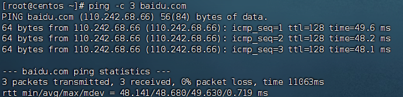

### wget命令

- wget是非交互式的文件下载器，可以在命令行内下载网络文件
- 语法:

```shell
wget [-b] url
```

- 选项:-b,可选,后台下载,会将日志写入到当前工作目录的wget-log文件
- 参数:url, 下载链接

示例：

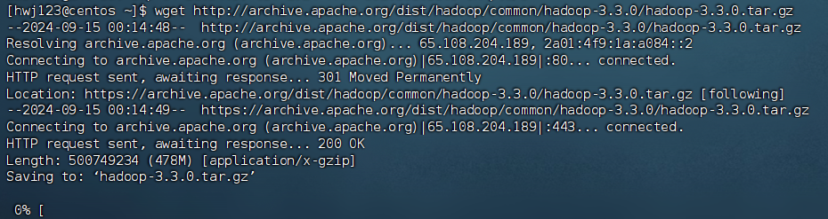

- 
  在后台下裁: wget -b http://archive.apache.org/dist/hadoop/common/hadoop-3.3.0/hadoop-3.3.0.tar.gz

- 通过tail命令可以监控后台下载进度:tail -f wget-log


<font color=red>注意:无论下载是否完成,都会生成要下载的文件,如果下载未完成,请及时清理未完成的不可用文件。</font>

### curl命令

- curl可以发送http网络请求，可用于:下载文件、获取信息等

- 语法:

```shell
cur1 [-0] ur1
```

- 选项:-0，用于下载文件，当url是下载链接时,可以使用此选项保存文件
- 参数:url,要发起请求的网络地址

示例：

- 向cip.cc发起网络请求:curl cip.cc

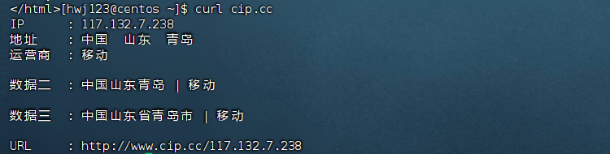

- 向python.itheima.com发起网络请求:curl python.itheima.com

直接展示html

- 通过curl下载hadoop-3.3.0安装包: curl -0 http://archive.apache.org/dist/hadoop/common/hadoop.3.3.0/hadoop-3.3.0.tar.gz

- 
  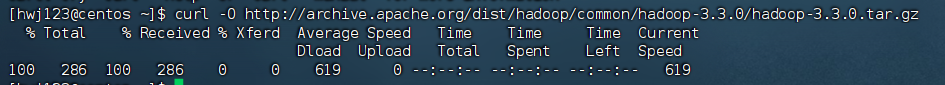


## 端口

### 什么是端口？

端口，是设备与外界通讯交流的出入口。端口可以分为:物理端口和虚拟端口两类

- 物理端口:又可称之为接口,是可见的端口,如USB接口，RJ45网口,HDMI端口等
- 虚拟端口:是指计算机内部的端口,是不可见的,是用来操作系统和外部进行交互使用的


计算机程序之间的通讯,通过IP只能锁定计算机,但是无法锁定具体的程序。通过端口可以锁定计算机上具体的程序,确保程序之间进行沟通


<font color =red>IP地址相当于小区地址,在小区内可以有许多住户(程序)而门牌号(端口)就是各个住户(程序)的联系地址</font>

### 端口的划分

Linux系统是一个超大号小区,可以支持65535个端口,这6万多个端口分为3类进行使用:

- 公认端口:1~1023,通常用于一些系统内置或知名程序的预留使用,如SSH服务的22端口,HTTPS服务的443端口非特殊需要，不要占用这个范围的端口
- 注册端口:1024~49151,通常可以随意使用,用于松散的绑定一些程序\服务
- 动态端口:49152~65535,通常不会固定绑定程序,而是当程序对外进行网络链接时,用于临时使用。


### 查看端口占用

- `nmap IP地址`,查看指定IP的对外暴露端口
- `netstat -anp | grep xxx`,查看本机指定端口号的占用情况
