# Linux（服务器操作系统)

# 第一章

## 1 操作系统概述

### 1.1 操作系统作用

调度和管理硬件

### 1.2 常见操作系统

PC端：Windows11，Linux, MacOS,

移动端：Andeoid，IOS，HarmonyOS

## 2 Linux初识

**Linux创始人：林纳斯.托瓦兹，1991**

**Linux内核**

<u>系统组成：</u>

- Linux系统内核（开源）
- 系统级应用程序

<u>功能:</u>

- 内核功能：调度cpu，调度内存，调度文件系统，调度通讯网络，调度IO等（调度硬件）
- 系统及应用程序：可理解为系统自带程序，可供用户快速上手操作系统，如：文件管理器，任务管理器，图片查看，音乐播放等。

**Linux发行版**

内核免费且开源，也代表了：

- 任何人都可以获得并修改内核，并自行集成系统级程序
- 提供了内核+系统级程序的完整封装，称之为Linux发行版

常用：CentOS,Ubantu

## 3 虚拟机介绍

### 3.1 什么是虚拟机？ 

虚拟的硬件+操作系统=虚拟的电脑

### 3.2 为什么用虚拟机？

获取Linux系统

## 4 Vmare Workstation 的安装

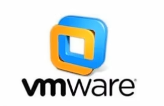

下载地址:https://www.vmware.com/cn/products/workstation-pro.html

## 5 远程连接Linux系统

### 5.1 操作系统的图形化、命令行2种操作模式

- 图形化操作是指使用操作系统附带的图形化页面，以图形化的窗口形式获得操作反馈，从而对操作系统进行操作、使用
- 命令行操作是指使用各种命令，以文字字符的形式获得操作反馈从而对操作系统进行操作、使用

### 5.2 理解为什么使用命令行操作Linux系统

- Linux从诞生至今，在图形化页面的优化上，并未重点发力。所以Linux操作系统的图形化页面:不好用、不稳定
- 在开发中，使用命令行形式，效率更高，更加直观，并且资源占用低，程序运行更稳定。

### 5.3 掌握使用FinalShell软件连接Linux操作系统

- 内容的复制、粘贴跨越VMware不方便
- 文件的上传、下载跨越VMware不方便
- 也就是和Linux系统的各类交互，跨越VMware不方便

我们可以通过第三方软件，FinalShell，远程连接到Linux操作系统之上。并通过Finalshell去操作Linux系统。

<u>Finalshell的下载地址为:</u>

[FinalShell SSH工具,服务器管理,远程桌面加速软件,支持Windows,macOS,Linux,版本4.5.6,更新日期2024.8.27 - FinalShell官网 (hostbuf.com)](https://www.hostbuf.com/t/988.html)

## 6 WSL

WSL作为Windows10系统带来的全新特性，正在逐步颠开发人员既有的选择。

- 传统方式获取Linux操作系统环境，是安装完整的虚拟机，如VMware
- 使用WSL，可以以非常轻量化的方式，得到Linux系统环境

目前，开发者正在逐步抛弃以虚拟机的形式获取Linux系统环境，而在逐步拥抱WSL环境。

WSL:Windows Subsystem for Linux，是用于Windows系统之上的Linux子系统
作用很简单，可以在Windows系统中获得Linux系统环境，并完全**直连计算机硬件**，无需通过虚拟机虚拟硬件

## 7 虚拟机快照的制作和还原

在学习阶段我们无法避免的可能损坏Linux操作系统。
如果损坏的话，重新安装一个Linux操作系统就会十分麻烦。

VMware虚拟机(Workstation和Funsion)支持为虚拟机制作快照。通过快照将当前虚拟机的状态保存下来,在以后可以通过快照恢复虚拟机到保存的状态

### 7.1 在VMware Workstation Pro中制作快照

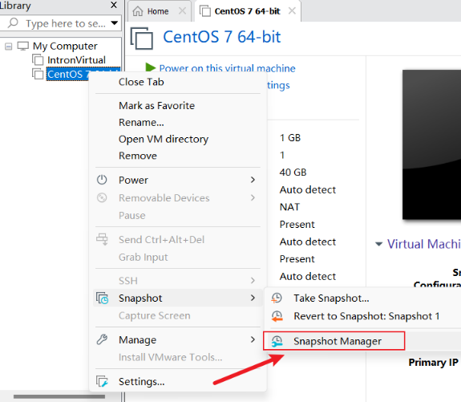

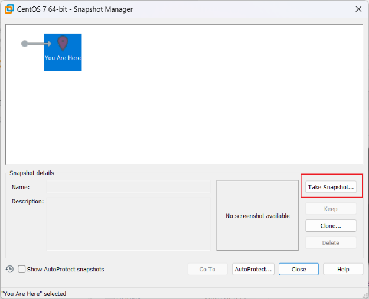

### 7.2 **在VMware Workstation Pro中还原快照**

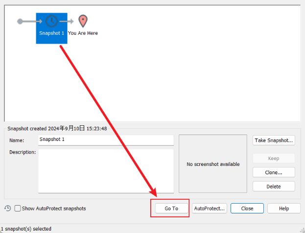

# 第二章

## 1 Linux目录结构

### 1.1 Linux的目录结构

Linux没有盘符这个概念,只有一个根目 / 所有文件都在它下面

### 1.2 Linux路径的描述方式

- 
  在Linux系统中，路径之间的层级关系，使用:/来表示

- 在windows系统中，路径之间的层级关系，使用:\来表示

  

## 2 Linux命令入门

### 2.1 什么是命令、命令行

- 命令:即Linux操作指令,是系统内置的程序，可以以字符化的形式去使用
- 命令行:即Linux终端,可以提供字符化的操作页面供命令执行

### 2.2 Linux命令的通用格式

~~~ 
command [-option][parameter]
~~~

- 命令本体，即命令本身
- 可选选项，控制命令的行为细节
- 可选参数，控制命令的指向目标

## 3 ls命令入门

~~~
ls [-a -l -h][Linux路径]
~~~

### 3.1 ls命令作用

在命令行中，以平铺的形式,展示当前工作目录(默认HOME目录)下的内容(文件或文件夹)

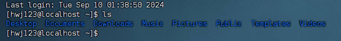

### 3.2 HOME目录

每一个用户在Linux系统的专属目录，默认在:/home/用户名

### 3.3 当前工作目录

Linux命令行在执行命令的时候,需要一个工作目录,打开命令行程序(终端)默认设置工作目录在用户的HOME目录

## 4 ls命令的参数和选项

### 4.1 ls命令的参数的作用

可以指定要查看的文件夹(目录)的内容,如果不给定参数,就查看当前工作目录的内容

### 4.2 ls命令的选项:

- -a 选项，可以展示出隐藏的内容，以 . 开头的文件或文件夹默认被隐藏，需要-a才能显示出来

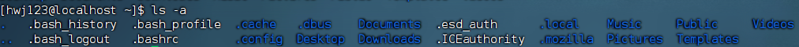

- -l 选项，以列表的形式展示内容,并展示更多细节

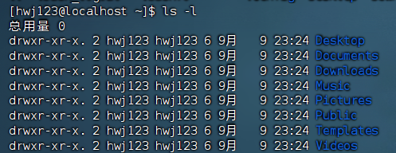

- -h 选项，需要和-l选项搭配使用，以更加人性化的方式显示文件的大小单位

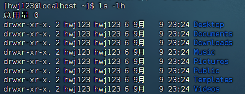

### 4.3 命令的选项组合使用

命令的选项是可以组合使用的，比如:ls -lah,等同于ls -a- l -h

## 5 cd/pwd命令

### 5.1 cd命令的作用

cd命令来自英文:Change Directorycd命令可以切换当前工作目录，语法是:

~~~
cd[Linux路径]
~~~

- 没有选项，只有参数，表示目标路径
- 使用参数切换到指定路径
- 不使用参数，切换工作目录到当前用户的HOME

### 5.2 pwd命令的作用

- pwd命令来自英文:Print Work Directory

- pwd命令，没有选项，没有参数，直接使用即可
- 作用是:输出当前所在的工作目录

## 6 相对命令、绝对命令

### 6.1 相对路径和绝对路径

- 绝对路径:以根目录做起点，描述路径的方式，路径以/开头
- 相对路径:以当前目录做起点，描述路径的方式，路径不需以/开头如无特殊需求

### 6.2 特殊路径符

- . 表示当前目录，比如cd.或cd./Desktop
- .. 表示上一级目录，比如:cd.. 或 cd../.
- ~ 表示用户的HOME目录，比如:cd\~或cd\~/Desktop

## 7 mkdir命令

### 7.1 mkdir命令的语法和功能

- mkdir用以创建新的目录(文件夹)
- 语法:

~~~
mkdir[-p]Linux路径
~~~

- 参数**必填**，表示要创建的目录的路径，相对、绝对、特殊路径符都可以使用

### 7.2 -p选项的作用

**可选**，表示自动创建不存在的父目录，适用于创建**连续多层**级的目录

## 8 touch、cat、more命令

### 8.1 touch命令

- 用于创建一个新的文件
- 语法:

~~~
touch Linux路径
~~~

- 参数必填，表示要创建的文件的路径，相对、绝对、特殊路径符都可以使用

### 8.2 cat命令

- 用于查看文件内容
- 语法:

~~~
cat Linux路径
~~~

- 参数必填，表示要查看的文件的路径，相对、绝对、特殊路径符都可以使用

### 8.3 more命令

- 用于查看文件内容，可翻页查看
- 语法: 

~~~
more Linux路径
~~~

- 参数必填，表示要查看的文件的路径，相对、绝对、特殊路径符都可以使用使用空格进行翻页，使用q退出查看

### 9 cp、mv、rm命令

### 9.1 cp命令

- 用于复制文件或文件夹

- 语法:

  ~~~
  cp[-r]参数1 参数2
  ~~~

- -r选项，可选，用于复制文件夹使用，表示递归

- 参数1，Linux路径，表示被复制的文件或文件夹

- 参数2，Linux路径，表示要复制去的地方

### 9.2 mv命令

- 用于移动或重命名文件/文件夹

- 语法:

  ~~~
  mv 参数1 参数2
  ~~~

- 参数1，Linux路径，表示被移动的文件或文件夹

- 参数2，Linux路径，表示要移动去的地方，如果目标不存在，则进行改名

### 9.3 rm命令

- 用于删除文件或文件夹

- 语法:

  ~~~
  rm[-r-f]参数1 参数2参数N
  ~~~

- -r选项，可选，文件夹删除

- -f选项，可选，用于强制删除(不提示，一般用于root用户)参数，表示被删除的文件或文件夹路径，支持多个，空格隔开参数也支持**通配符 ***，用以做模糊匹配

## 10 which,find命令

### 10.1 which命令

- 查找命令的程序文件

- 语法:

  ~~~
  which 要查找的命令
  ~~~

- 无需选项，只需要参数表示查找哪个命令

### 10.2 find命令

- 用于查找指定的文件

- 按文件名查找:

  ~~~
  find 起始路径 -name“被查找文件名
  ~~~

  - 支持通配符

- 按文件大小查找:

  ~~~
  find 起始路径-size +| -n[kMG]
  ~~~

## 11 grep,wc,管道符

### 11.1 grep命令

- 从文件中通过关键字过滤文件行

- 语法:

  ~~~
  grep[-n]关键字 文件路径
  ~~~

- 选项-n，可选，表示在结果中显示匹配的行的行号，

- 参数，关键字，必填，表示过滤的关键字，建议使用””将关键字包围起来

- 参数，文件路径，必填，表示要过滤内容的文件路径，**可作为管道符的输入**

### 11.2 wc命令

- 命令统计文件的行数、单词数量、字节数、字符数等

- 语法:

  ~~~
  wc[-c-m-1-w]文件路径
  ~~~

- 不带选项默认统计:行数、单词数、字节数

- -c字节数、-m字符数、-l行数、-w单词数

- 参数，被统计的文件路径，可作为**管道符的输入**

### 11.3 管道符|

将管道符左边的结果，作为右边命令的输入

## 12 echo,tail,重定向符

### 12.1 echo

- 可以使用echo命令在命令行内输出指定内容
- 语法:

~~~
echo 输出的内容
~~~

- 无需选项，只有一个参数，表示要输出的内容，复杂内容可以用””包围

### 12.2 反引号符

- 被`包围的内容，会被作为命令执行，而非普通字符

### 12.3 重定向符

- 将符号左边的结果，输出到右边指定的文件中去

- `>`，表示覆盖输出
- `>>`，表示追加输出

### 12.4 tail

- 使用tail命令，可以查看文件尾部内容，跟踪文件的最新更改

- 语法:

  ~~~
  tail[-f -num]Linux路径
  ~~~

- 参数，Linux路径，表示被跟踪的文件路径

- 选项，-f，表示持续跟踪

- 选项,-num，表示，查看尾部多少行，不填默认10行

## 13 vi编辑器

vi\vim是visual interface的简称,是Linux中最经典的文本编辑器

同图形化界面中的文本编辑器一样，vi是命令行下对文本文件进行编辑的绝佳选择。

vim 是 vi 的加强版本，兼容 vi 的所有指令，不仅能编辑文本，而且还具有 shelll程序编辑的功能，可以不同颜色的字体来辨别语法的正确性，极大方便了程序的设计和编辑性。

    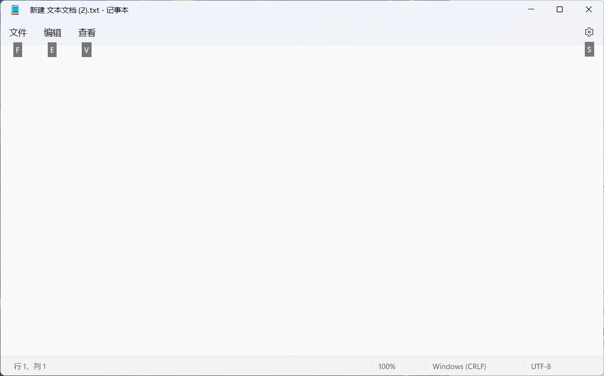
    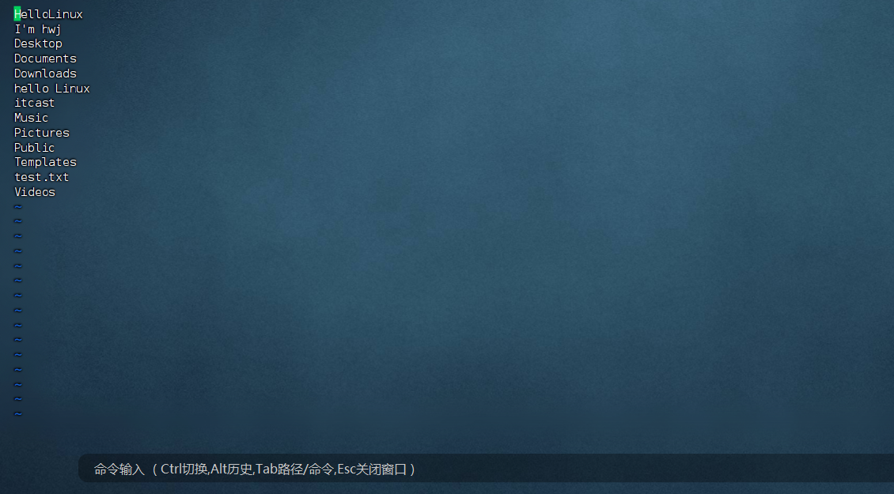

### 13.1 三种工作模式

- 命令模式，默认的模式，可以通过键盘快捷键控制文件内容
- 输入模式，通过命令模式进入，可以输入内容进行编辑，按esc退回命令模式
- 底线命令模式，通过命令模式进入，可以对文件进行保存、关闭等操作

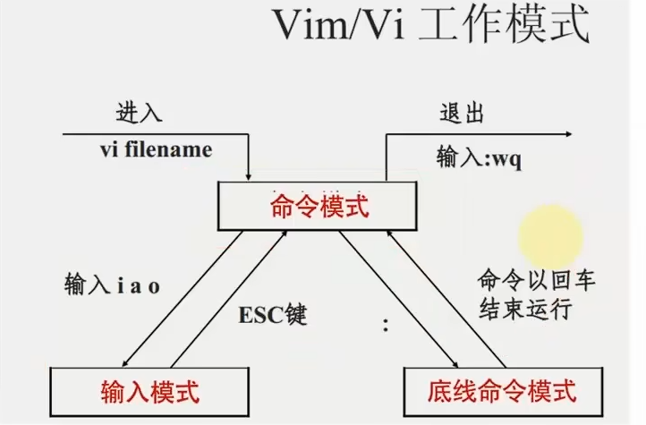

### 13.2 命令模式快捷键

### 13.3 底线命令快捷键

