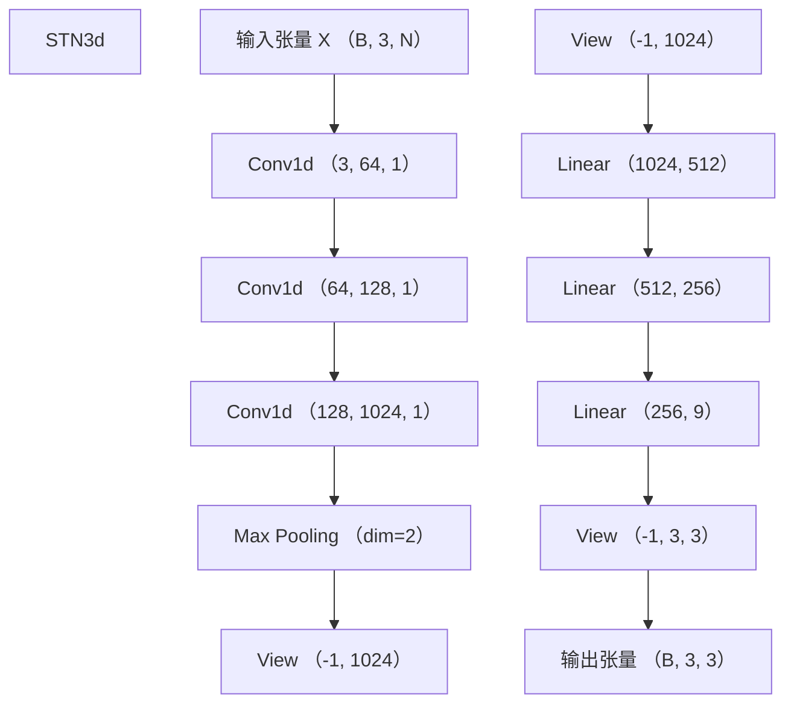
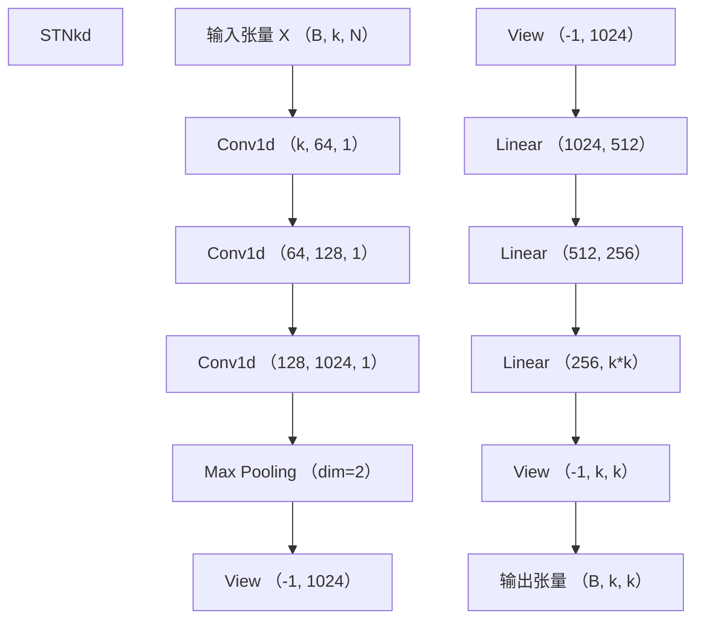
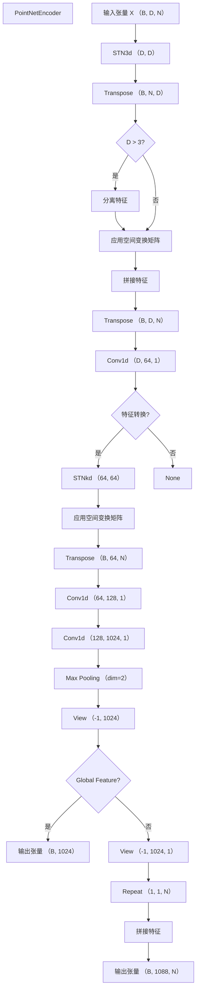
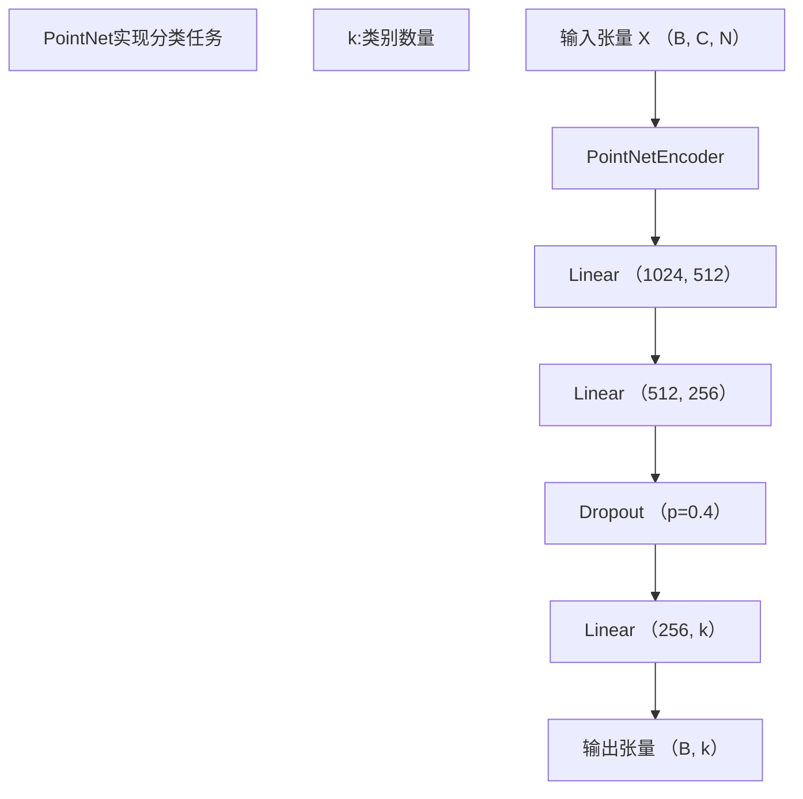
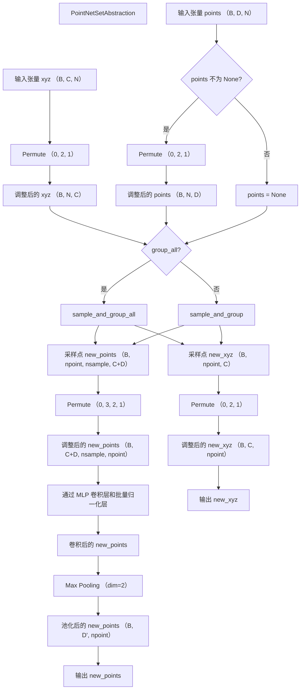
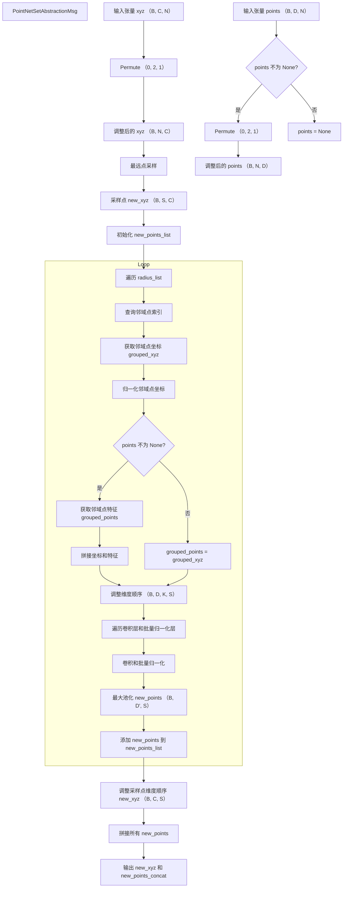

# PointNet++: Deep Hierarchical Feature Learning on Point Sets in a Metric Space

## 标题与摘要

- **论文标题**：PointNet++:在度量空间中对点集进行深度分层特征学习

​	PointNet++ 通过递归地在点集的**嵌套划分**上应用 PointNet，有效地捕获了点云的**局部特征**，并能够处理**不同密度**的采样数据。它在多个3D点云基准测试中取得了优异的性能，显著优于原始的 PointNet 和其他现有的方法。PointNet++ 的关键贡献包括其**层次化**的特征学习框架和对**非均匀**采样密度的**鲁棒性**，这使得它能够学习出深度点集特征，并在诸如分类和分割等任务中实现精确的点云分析。

## 引言

- **研究领域**： **点云** **多尺度特征学习**

- **研究动机：**

  1. 以往很少有研究点集深度学习的相关工作。
  2. PointNet**简洁而有效**，然而PointNet **没有捕捉**到由度量诱导的**局部结构**。并且利用**局部结构**已被证明对卷积架构的**成功**至关重要。
  3. 沿着**层次结构抽象局部模式**的能力使得对未见过的情况具有更好的**泛化能力**。

  

- **PointNet局限：**

  - **局部结构捕捉不足**
  - **对非均匀采样密度的适应性差**
  - **特征尺度单一**

  

- **改进：**

  - **分层结构**： PointNet++ 通过递归地应用 PointNet 在局部邻域内提取特征，从而能够捕捉点云的局部结构。这种分层结构允许网络从点云的不同尺度中提取更丰富的局部信息。

  - **多尺度分组** (Multi-scale Grouping, MSG) 和 **多分辨率分组** (Multi-resolution Grouping, MRG)**： 为了解决点集密度不均匀的问题，PointNet++ 提出了 MSG 方法，在每一层都通过多个尺度来确定每个中心点的领域范围，每个范围都经过 PointNet 提取特征，再将得到的多个范围的特征concatenate起来，得到一个多尺度的新特征。MRG 方法则在计算上更加高效，因为它避免了在最低级别的大规模邻域中进行特征提取。
  - **自适应密度的特征提取**： PointNet++ 能够自适应地结合来自多个尺度的特征，这使得网络能够处理在不同区域具有不同密度的点集。这种自适应性的提高有助于网络更好地理解和捕捉点云数据的复杂性。
  - **最远点采样** (Farthest Point Sampling, FPS)**： 为了均匀覆盖整个点集，PointNet++ 使用 FPS 算法选择质心点，这与以固定步长扫描空间的体积卷积神经网络 (volumetric CNNs) 不同，PointNet++ 的局部感受野取决于输入数据和度量标准，因此更加高效和有效。

  通过这些改进，PointNet++ 能够有效地处理点集，并在具有挑战性的 3D 点云基准测试中取得了优于最先进水平的结果。

## 研究方法

### **模型结构**：

1. **输入点集的嵌套划分**：PointNet++首先将输入的点集划分为重叠的局部区域。这是通过距离度量来定义的，类似于在卷积神经网络（CNN）中扫描空间的方式。

2. **采样层（Sampling layer）**：使用`farthest point sampling`选择N'个点，至于为什么选择使用这种方法选择点，文中提到相比于随机采样，这种方法能更好的的覆盖整个点集。具体选择多少个中心点，数量怎么确定，是由人来指定的。

3. **分组层（Grouping layer）**：对于每个质心，该层找到其周围的“邻近”点，构建局部区域集合。这些局部区域是通过度量距离来定义的，可以是球形查询（Ball Query）或k最近邻（k-Nearest Neighbors, kNN）搜索。两者的对于结果的影响并不大。

   

4. **PointNet层**：这一层是PointNet，接受N'×K×(d+C)的输入。输出是N'×(d+C)。需要注意的是，在输入到网络之前，会把该区域中的点变成围绕中心点的相对坐标。作者提到，这样做能够获取点与点之间的关系（对这一点存疑，但感觉有限像Batch Norm？）。

5. **集合抽象层（Set Abstraction layer）**：这一层将上述层的输出作为输入，并输出一个新的点集，其中包含更少的元素，但每个元素都有新的特征向量，这些向量总结了局部上下文。

6. **密度自适应层（Density Adaptive Layers）**：

   处理非均匀点云的方法

   - 多尺度分组（Multi-scale Grouping, MSG）

     对于同一个中心点，如果使用3个不同尺度的话，就分别找围绕每个中心点画3个区域，每个区域的半径及里面的点的个数不同。对于同一个中心点来说，不同尺度的区域送入不同的PointNet进行特征提取，之后concat，作为这个中心点的特征。也就是说MSG实际上相当于并联了多个hierarchical structure，每个结构中心点数量一样，但是区域范围不同（可以理解成感受野？），PointNet的输入和输出尺寸也不同，然后几个不同尺度的结构在PointNet有一个Concat。

     

   - 多分辨率分组（Multi-resolution Grouping, MRG）

     MSG很明显会影响降低运算速度，所以提出了MRG，这种方法应该是对不同level的grouping做了一个concat，但是由于尺度不同，对于low level的先放入一个pointnet进行处理再和high level的进行concat。感觉和ResNet中的跳连接有点类似。

7. **random input dropout（DP）**

   在输入到点云之前，对点集进行随机的Dropout,比例使用了95%，也就是说进行95%的重新采样。某种程度有点像数据增强，也是提高模型的robustness。

**<u>方法效果</u>**

​	两种方式的具体性能如上图所示,可以看到,通过采用MSG+DP的整体效果是最好的.而且根据对比可以看出,加了DP,鲁棒性更好..

​	而且根据论文的分割实验可以看到,MSG+DP是整体性能最好的.

### 数据处理流程

1. **数据预处理**：
   - 对于3D点云数据，通常需要从原始的几何模型中采样点，以生成适合神经网络处理的点集。
   - 对于2D图像数据，如MNIST数据集，点云是通过将图像的像素位置转换为2D点云来生成的。
2. **点集采样**：
   - 使用最远点采样（Farthest Point Sampling, FPS）算法从原始点集中选择一组点，这些点作为局部区域的质心。
3. **局部区域构建**：
   - 对于每个质心点，使用球形查询（Ball Query）或k最近邻（k-Nearest Neighbors, kNN）搜索来找到其周围的邻近点，构建局部区域。
4. **局部特征提取**：
   - 对每个局部区域，应用PointNet层来提取局部特征。PointNet层将局部区域的坐标和特征作为输入，输出编码了局部区域模式的特征向量。
5. **层次化特征学习**：
   - 通过多个层次的集合抽象层（Set Abstraction layers），递归地在点集的嵌套划分上应用PointNet，以学习不同尺度的局部特征。
6. **密度自适应特征组合**：
   - 根据局部点密度，使用密度自适应层（如多尺度分组MSG或多分辨率分组MRG）来组合不同尺度的特征。
7. **特征传播**：
   - 使用特征传播层（Feature Propagation layers）将从子采样点集中的点特征传播回原始点集的所有点，以便进行分割任务。
8. **分类或分割**：
   - 对于分类任务，将提取的特征输入到全连接层，然后进行分类。
   - 对于分割任务，将特征传播回原始点集，然后对每个点进行分割。
9. **训练与优化**：
   - 使用适当的损失函数（如交叉熵损失）来训练模型，并通过反向传播算法来优化网络参数。
10. **评估与测试**：
    - 在测试集上评估模型的性能，使用准确率、IoU（交并比）等指标来衡量分类和分割任务的性能。

整个数据处理流程是端到端的，从原始的点云数据到最终的分类或分割结果，PointNet++模型能够有效地处理点集数据，并学习到具有区分性的特征。

**<u>PointNet</u>**

​	T-Net通过卷积神经网络对输入点云的坐标进行特征学习，最终学得一个空间变换矩阵，该矩阵能够对所有点的坐标进行对齐和标准化，从而减小旋转、平移和尺度变化对特征提取的影响。

正则化项使用 Frobenius 范数来衡量**变换矩阵与其转置矩阵乘积**与**单位矩阵**之间的差异

在损失函数中
$$
loss = loss\_cls + λloss\_reg
$$

**<u>PointNet++</u>**

PointNet++ utils

~~~python
def sample_and_group_all(xyz, points):
    """
    输入:
        xyz: 输入点的位置信息, [B, N, 3]
        points: 输入点的数据, [B, N, D]
    返回:
        new_xyz: 采样点的位置信息, [B, 1, 3]
        new_points: 采样点的数据, [B, 1, N, 3+D]
    """
~~~

~~~python
def sample_and_group(npoint, radius, nsample, xyz, points, returnfps=False):
    """
    输入:
        npoint: 采样点的数量
        radius: 局部区域的半径
        nsample: 局部区域内的最大采样点数
        xyz: 输入点的位置信息, [B, N, 3]
        points: 输入点的数据, [B, N, D]
    返回:
        new_xyz: 采样点的位置信息, [B, npoint, nsample, 3]
        new_points: 采样点的数据, [B, npoint, nsample, 3+D]
    """
~~~

### `PointNetSetAbstraction`

#### 功能

- 进行点云数据的采样和分组操作。
- 提取局部特征。

#### 特点

- 使用单一尺度进行分组和特征提取。
- 对每个采样点的局部区域进行固定半径和固定数量的邻域点采样。

### `PointNetSetAbstractionMsg`

#### 功能

- 进行点云数据的多尺度采样和分组操作。
- 提取多尺度的局部特征。

#### 特点

- 使用多种尺度进行分组和特征提取。
- 对每个采样点的局部区域进行多个不同半径和不同数量的邻域点采样。
- 能够捕捉不同尺度的几何信息，更加丰富和全面。

### **数学公式**

1. **最远点采样（Farthest Point Sampling, FPS）**: FPS是一种用于从点集中选择点的算法，它旨在以一种方式选择点，使得这些点能够尽可能地覆盖整个点集。FPS的数学描述通常涉及到迭代过程，但在论文中可能并没有直接给出具体的公式。简单来说，FPS从一个随机点开始，然后选择距离已选点集最远的点作为下一个点，这个过程重复进行直到选满所需数量的点。

2. **球形查询（Ball Query）**: 球形查询用于找到位于某个点周围一定半径内的所有点。这在论文中可以用以下公式表示： 
   $$
   B(x_i,r)=\{x_j|d(x_i,x_j)\leq r\}
   $$

3. 其中，$B(x_i,r)$ 表示以点 $d(x_i,x_j)$为中心，半径为 $r$的球体内的点集， $d(x_i,x_j)$是点 $x_i$ 和$x_j$之间的距离。

4. **PointNet层**: **PointNet**层用于提取局部区域的特征。它通常包含一个多层感知机（MLP），可以表示为：
   $$
   f(x_1,x_2,\dots,x_n)=\gamma\left(\max_{i=1,\dots,n}\{h(x_i)\}\right)
   $$
   

    其中，$x_1,x_2,\dots,x_n$是局部区域内的点，$h$是一个MLP网络，用于提取每个点的特征， $\gamma$是一个聚合函数，通常是另一个MLP，用于从所有点的特征中生成局部区域的特征向量。

5. **特征传播（Feature Propagation）**: 特征传播层用于将子采样点的特征传播回原始点集。这通常通过插值实现，可以使用如下的加权平均公式：
   $$
   f^{(j)}(x)=\frac{\sum_{i=1}^kw_if_i^{(j)}}{\sum_{i=1}^kw_i(x)}
   $$
   

    其中，$f_i^{(j)}$ 是第 $i$ 个最近邻点的特征向量中的第 $j$ 个分量， $w_i(x)$ 是基于距离的反距离权重， $k$ 是最近邻的数量。

## 实验设计

### 数据集：

1. **MNIST**：这是一个手写数字的图像数据集，作者将其转换为2D点云数据，用于分类任务。
2. **ModelNet40**：这是一个3D CAD模型的数据集，包含40个类别的对象，用于3D点云分类。
3. **SHREC15**：这是一个包含50个类别的非刚性3D形状数据集，用于非刚性形状分类。
4. **ScanNet**：这是一个包含1513个扫描和重建的室内场景的3D数据集，用于语义场景标注。

### 对比方法：

1. **PointNet (vanilla)**：这是PointNet的原始版本，没有使用转换网络（transformation networks），作为对比基准。
2. **Multi-layer perceptron (MLP)**：多层感知器，用于分类任务。
3. **LeNet5**：这是一个早期的卷积神经网络，用于图像分类。
4. **Network in Network (NiN)**：这是一种网络架构，使用微型网络作为内部网络结构。
5. **Subvolume**：这是一个3D CNN方法，用于点云分类。
6. **MVCNN**：这是一个多视图卷积神经网络，用于3D点云分类。
7. **3DCNN**：这是一个用于3D点云分类的卷积神经网络。
8. **PointNet++ with single scale grouping (SSG)**：这是PointNet++的一个版本，只在每个层次上使用单一尺度的分组。
9. **PointNet++ with multi-scale grouping (MSG)**：这是PointNet++的一个版本，使用多尺度分组来捕获多尺度模式。
10. **PointNet++ with multi-resolution grouping (MRG)**：这是PointNet++的一个版本，使用多分辨率分组来处理不同密度的点云。

### 实验设置：

- 对于MNIST和ModelNet40数据集，作者使用了不同数量的点（例如512或1024个点）来训练和测试模型。
- 对于SHREC15数据集，作者使用了五折交叉验证来评估分类准确率。
- 对于ScanNet数据集，作者使用了1201个场景进行训练，312个场景进行测试，并报告了平均体素分类准确率。

## 结果分析

以下是论文中提到的部分实验结果整理成的Markdown表格：

### MNIST 数据集上的分类结果：

| 方法                   | 错误率 (%) |
| :--------------------- | :--------- |
| Multi-layer perceptron | 1.60       |
| LeNet5                 | 0.80       |
| Network in Network     | 0.47       |
| PointNet (vanilla)     | 1.30       |
| PointNet               | 0.78       |
| Ours (PointNet++)      | 0.51       |

**MNIST 数据集上的分类结果分析：**

- **PointNet++** 显著优于其他方法，包括多层感知器、LeNet5、Network in Network，以及原始的 **PointNet**。
- 这表明 **PointNet++** 在处理图像数据（通过点云形式表示）时，能够有效地捕获空间特征，从而提高分类准确率。

### ModelNet40 数据集上的分类结果：

| 方法               | 输入点数 | 准确率 (%) |
| :----------------- | :------- | :--------- |
| Subvolume          | vox      | 89.2       |
| MVCNN              | img      | 90.1       |
| PointNet (vanilla) | pc       | 87.2       |
| PointNet           | pc       | 89.2       |
| Ours (PointNet++)  | pc       | 90.7       |
| Ours (with normal) | pc       | 91.9       |

**ModelNet40 数据集上的分类结果分析：**

- **PointNet++** 在使用相同输入数据大小（1024个点）和特征（仅坐标）的情况下，性能明显优于 **PointNet**。
- 使用面法线信息作为额外特征时，**PointNet++** 的性能进一步提升，说明 **PointNet++** 能够利用额外的几何信息来提高分类准确率。
- 与成熟的图像CNN方法（如MVCNN）相比，基于点云的方法（如 **PointNet++**）能够达到相似或更好的性能，这证明了点云作为3D数据表示的有效性。

### ScanNet 数据集上的语义场景标注结果：

| 方法     | 准确率 (%) |
| :------- | :--------- |
| 3DCNN    | 0.730      |
| PointNet | 0.739      |
| Ours     | 0.845      |

**ScanNet 数据集上的语义场景标注结果分析：**

- **PointNet++** 在语义场景标注任务中取得了最高的准确率，这证明了其在处理真实世界3D场景数据时的有效性和鲁棒性。
- 该任务中 **PointNet++** 相对于其他方法（如3DCNN和原始的PointNet）的性能提升，强调了层次化特征学习在处理复杂场景中的重要性。

### SHREC15 数据集上的非刚性形状分类结果：

| 方法                                    | 输入特征           | 准确率 (%) |
| :-------------------------------------- | :----------------- | :--------- |
| DeepGM                                  | Intrinsic features | 93.03      |
| Ours (Euclidean XYZ)                    | XYZ                | 60.18      |
| Ours (Euclidean Intrinsic features)     | Intrinsic features | 94.49      |
| Ours (Non-Euclidean Intrinsic features) | Intrinsic features | 96.09      |

**SHREC15 数据集上的非刚性形状分类结果分析：**

- 在利用非欧几里得度量空间和内在特征时，**PointNet++** 的性能显著优于其他方法。
- 这表明 **PointNet++** 能够理解和利用数据的内在几何结构，这对于非刚性形状分类尤为重要。

### 时间空间复杂度比较：

| 方法               | 模型大小 (MB) | 前向时间 (ms) |
| :----------------- | :------------ | :------------ |
| PointNet (vanilla) | 9.4           | 11.6          |
| PointNet           | 40            | 25.3          |
| Ours (SSG)         | 8.7           | 82.4          |
| Ours (MSG)         | 12            | 163.2         |
| Ours (MRG)         | 24            | 87.0          |

### 时间空间复杂度比较分析：

- **PointNet++** 在模型大小和推理速度方面与 **PointNet** 相当，尽管它引入了更复杂的层次结构。
- 多尺度分组（MSG）虽然性能更好，但计算成本更高，这强调了在实际应用中需要在性能和效率之间做出权衡。

​	总体而言，实验结果表明 **PointNet++** 是一个强大的神经网络架构，能够有效地处理点云数据，并在多个任务和数据集上实现最先进的性能。其层次化特征学习能力和对非均匀采样密度的鲁棒性，使其成为3D点云分析的有力工具。

## 总结与未来工作

1. **加速网络推理速度**：对于 MSG 和 MRG 层，可以通过在局部区域内共享更多的计算来加速网络的推理速度，从而提高效率。
2. **高维度量空间的应用**：探索 PointNet++ 在高维度量空间中的应用，例如时间序列数据分析或高维传感器数据，其中基于卷积的方法可能计算代价过高。
3. **计算效率的优化**：尽管 PointNet++ 在性能上取得了显著提升，但 MSG 层的计算成本较高。未来的工作可以集中在开发更高效的算法，以在保持性能的同时减少计算量。
4. **更广泛的应用领域**：将 PointNet++ 应用于更多的领域，如自动驾驶、机器人导航和增强现实等，这些领域中的3D数据分析和理解至关重要。
5. **网络架构的改进**：继续研究和改进网络架构，以更好地捕获点云数据的复杂结构和动态变化。
6. **无监督学习和半监督学习**：探索 PointNet++ 在无监督学习和半监督学习场景下的应用，以减少对大规模标注数据的依赖。
7. **多模态数据融合**：研究 PointNet++ 如何与图像、文本等其他模态数据结合，以提供更全面的场景理解。
8. **可解释性和透明度**：提高模型的可解释性，让用户理解网络是如何学习和预测点云数据的。

通过这些未来的研究方向，PointNet++ 有潜力成为3D点云数据处理和分析领域的一个重要工具，并在更广泛的应用中发挥作用。

## 思考

> [!NOTE]
>
> **PointNet有什么特殊的，为什么要选择他来进行改进？**
>
> PointNet 是一种特殊的深度学习架构，专门设计用于直接处理点云数据。以下是 PointNet 的一些独特特点，这些特点使其成为进行改进的理想选择：
>
> 1. **无序集处理**：PointNet 能够处理无序的点集数据，这意味着它不需要对输入点进行任何排序或结构化的预处理。这种能力对于处理3D点云数据非常重要，因为点云中的点的顺序并不影响其表示的几何形状。
> 2. **空间编码**：PointNet 通过对每个点进行空间编码来学习点的特征，这有助于捕捉点的几何和拓扑信息。
> 3. **全局特征聚合**：PointNet 通过一个对称函数（如最大池化）将所有点的特征聚合到一个全局的特征向量中，这个全局特征向量能够代表整个点集。
> 4. **简单有效的架构**：PointNet 的架构相对简单，易于实现，且计算效率高。这使得它成为许多点云处理任务的强大基线。
> 5. **鲁棒性**：PointNet 对输入数据的扰动和变形表现出很好的鲁棒性，这对于实际应用中的数据变化非常重要。
> 6. **适用性广泛**：PointNet 不仅可以用于分类任务，还可以通过网络结构的简单调整用于分割和检测等其他任务。
>
> 尽管 PointNet 有这些优点，但在处理局部结构和非均匀采样密度方面存在局限性。这些局限性导致了 PointNet 无法充分捕捉细粒度的局部特征和复杂场景的全局结构。因此，PointNet++ 被提出以改进这些不足，通过引入层次化结构和密度自适应层来增强网络对局部结构和不同采样密度的处理能力。PointNet++ 在保持 PointNet 简单和高效的同时，显著提高了点云数据的处理性能。

> [!NOTE]
>
> **PointNet++是如何捕捉局部特征的？**
>
> PointNet++ 捕捉局部特征的方法主要包括以下几个步骤：
>
> 1. **分层点集特征学习** (Hierarchical Point Set Feature Learning)： PointNet++ 通过构建点的分层分组，并沿着层次结构逐步抽象出越来越大的局部区域网络结构。
> 2. **集合抽象层** (Set Abstraction Layer)： 在集合抽象层中，PointNet++ 通过三个关键层来处理点集：采样层 (Sampling layer)、分组层 (Grouping layer) 和 PointNet 层。采样层从输入点中选择一组局部区域质心点，分组层通过查找质心周围的“相邻”点来构造局部区域集，而 PointNet 层使用 mini-PointNet 将局部区域模式编码为特征向量。
> 3. **多尺度分组** (Multi-scale Grouping, MSG) 和 **多分辨率分组** (Multi-resolution Grouping, MRG)： 由于点集在不同区域的密度不均匀，PointNet++ 提出了密度自适应的 PointNet 层来应对这一挑战。MSG 在每个质心点的大规模邻域中运行本地 PointNet，而 MRG 在计算上更加高效，因为它避免了在最低级别的大规模邻域中进行特征提取。
> 4. **密度自适应特征学习**： 在不均匀采样密度的情况下，PointNet++ 通过学习从区域的不同尺度组合特征来适应性地加权在不同尺度检测到的模式，并根据输入数据组合多尺度特征。
>
> 通过这些方法，PointNet++ 能够有效地处理点集，并在具有挑战性的 3D 点云基准测试中取得了优于最先进水平的结果。

> [!NOTE]
>
> **MRG 方法是是什么，不太理解？**
>
> 

## 测试

**人机训练：我想知道自己是否已经理解了`PointNet++: Deep Hierarchical Feature Learning on Point Sets in a Metric Space`这篇论文，你来出几个问题测试以下我吧？**

好的！我可以给你出一些关于 `PointNet++` 论文的测试问题。以下问题会从核心概念、架构细节、创新点和实际应用等几个方面来考察你的理解：

### 基础理解

1. PointNet++ 相比于 PointNet，有哪些主要改进？它是如何解决 PointNet 的不足之处的？
2. PointNet++ 通过什么样的方式对点云数据进行分层处理？每一层的目的是什么？

### 技术细节

1. 在 PointNet++ 的分层结构中，Sample and Group 阶段的作用是什么？具体是如何实现的？
2. 如何定义和选择 PointNet++ 中的“邻域（neighborhood）”？不同邻域的选择对模型的效果有什么影响？
3. 在每一层特征提取阶段，PointNet++ 使用了“聚合”操作。可以描述一下这种操作的目的和具体方式吗？

### 创新与优势

1. 你认为 PointNet++ 提出的“层次化特征学习”相对于之前的点云处理方法（例如 PointNet）有哪些优势？
2. PointNet++ 如何处理非均匀分布的点云？为什么这个处理对三维点云数据的学习非常重要？

### 实际应用

1. 你认为 PointNet++ 更适合于哪些场景和任务？例如，它在分类、分割、或者三维场景理解任务中的表现如何？
2. 是否能举出一个实际场景，说明 PointNet++ 的分层结构在处理三维数据时的优势？

## 答案

### 基础理解

1. **PointNet++ 相比于 PointNet，有哪些主要改进？它是如何解决 PointNet 的不足之处的？**
   - **改进**：PointNet++ 相比于 PointNet，引入了“分层的特征提取机制”，通过分层的局部区域特征提取结构来学习点云的局部信息。
   - **解决的问题**：PointNet 直接对全局点云数据做整体处理，忽略了局部的几何结构，难以捕获局部特征。因此，PointNet++ 在层次化特征提取过程中分区处理点云数据，使得模型能够提取点云的局部和全局特征，弥补了原始 PointNet 的局限性。
2. **PointNet++ 通过什么样的方式对点云数据进行分层处理？每一层的目的是什么？**
   - **分层方式**：PointNet++ 将点云数据分成多个层，每一层中将点云划分为若干局部区域（neighborhood），并对这些局部区域应用小型 PointNet 模块来提取局部特征。
   - **目的**：通过分层结构，PointNet++ 可以逐渐扩大感受野，低层的网络关注点的局部关系，而高层则能够整合更大范围的上下文信息，从而实现对全局特征的学习。

### 技术细节

1. **在 PointNet++ 的分层结构中，Sample and Group 阶段的作用是什么？具体是如何实现的？**
   - **作用**：Sample 阶段用于从点云中采样关键点，减少计算量；Group 阶段则将采样点周围的邻域点群组合在一起，形成局部区域。
   - **实现方法**：Sample 阶段通常采用 Farthest Point Sampling（FPS）算法，确保采样的点均匀分布于整个点云；Group 阶段则会基于距离阈值选择采样点周围的若干邻域点，定义局部区域。
2. **如何定义和选择 PointNet++ 中的“邻域（neighborhood）”？不同邻域的选择对模型的效果有什么影响？**
   - **定义**：在 PointNet++ 中，邻域一般基于欧式距离进行定义，模型会选择一定半径或一定数量的邻近点来构成局部区域。
   - **影响**：不同的邻域选择方式会影响模型的特征提取效果。较小的邻域适合提取细粒度的局部特征，而较大的邻域可以捕获全局或大范围的上下文信息。通过在不同层使用不同大小的邻域，PointNet++ 可以多尺度地学习点云的细节和整体信息。
3. **在每一层特征提取阶段，PointNet++ 使用了“聚合”操作。可以描述一下这种操作的目的和具体方式吗？**
   - **目的**：聚合操作的目的是将局部区域内的点云特征融合为一个单一的特征向量，从而压缩信息量并去除冗余。
   - **具体方式**：PointNet++ 通常采用最大池化（max-pooling）操作来聚合局部区域内点的特征，保留最显著的特征信息，这样可以保证旋转、平移和排列不变性。

### 创新与优势

1. **你认为 PointNet++ 提出的“层次化特征学习”相对于之前的点云处理方法（例如 PointNet）有哪些优势？**
   - **优势**：层次化特征学习允许 PointNet++ 在多尺度上捕捉点云的局部细节和全局信息，既能保留细粒度特征，也能获得大范围的上下文关系。相比于 PointNet 的单层全局特征提取，PointNet++ 可以更好地处理具有复杂几何结构的点云数据。
2. **PointNet++ 如何处理非均匀分布的点云？为什么这个处理对三维点云数据的学习非常重要？**
   - **处理方式**：PointNet++ 通过使用自适应的采样策略和多尺度分层结构，能够更有效地处理非均匀分布的数据。比如，密集区域的采样密度会高于稀疏区域，这样可以确保重要的细节区域得到充分采样。
   - **重要性**：现实中的点云数据通常是非均匀分布的，包含密集和稀疏区域。如果不加以处理，模型在稀疏区域可能会失去关键的结构信息，影响对整体形状的理解。

### 实际应用

1. **你认为 PointNet++ 更适合于哪些场景和任务？例如，它在分类、分割、或者三维场景理解任务中的表现如何？**
   - **适用场景**：PointNet++ 擅长处理三维点云的分类、分割、目标检测等任务，尤其是在具有复杂几何结构和多尺度特征的场景中表现出色。它能够在室内场景理解、无人驾驶中的障碍物检测和三维模型重建中发挥作用。
   - **表现**：由于其分层特征提取机制，PointNet++ 在分割和分类任务中的性能通常优于 PointNet，能够在保持高准确度的前提下，实现对复杂场景的细粒度分割。
2. **是否能举出一个实际场景，说明 PointNet++ 的分层结构在处理三维数据时的优势？**
   - **场景例子**：在无人驾驶汽车的环境感知中，点云数据用于检测道路障碍物。PointNet++ 的分层结构可以首先在低层捕捉车辆附近的路面和障碍物的细节特征，在高层则可以整合车辆周围的大范围信息。这样，模型可以更全面地理解车周环境，实现对行人、车辆和其他障碍物的准确识别与分割。